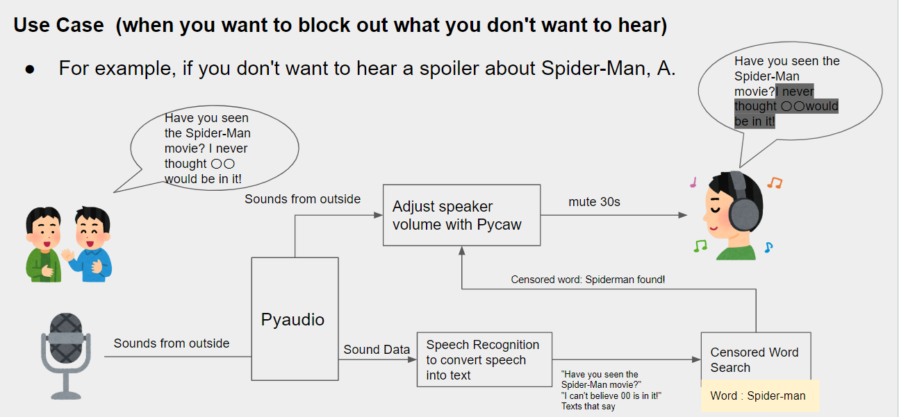

When we obtain information visually, it is possible to filter only the information we want to obtain,
for example, by using a recommendation function for online shopping. 

On the other hand, in the auditory sense, technologies that uniformly cut noise in specific frequency bands in the outside world, such as noise cancellation, have been put to practical use, but there are still few technologies that cut specific information such as keywords that appear in speech. 

If such technology is put to practical use, it is expected to contribute to the improvement of productivity and creativity in work involving listening. 

In this study, we will develop a system that automatically adjusts the gain of speech corresponding to specific keywords.

The system was written in Python, with speech gain adjustment performed by Pyaudio and Pycaw, and speech textualization by Google's Speech Recognition.

By registering words that you want to hear or not to hear, the system can selectively highlight or mute conversations that contain those words.

 We also examined the effect of this system on the user’s task performance.

### Tech Blog
- [【Python】聞きたい情報を強調し、聞きたくない情報を検閲する耳能力拡張デバイスのプロトタイプを作った【Pyaudio】](https://chamekichi.hatenadiary.jp/entry/2022/05/30/224751)

### CONFERENCE PRESANTATiONS
Development of a device that automatically adjusts the gain of specific keywords that appear in speech.
Gakuto Sasabe, Shunichi Amano
23th Society of Instrument and Control Engineers System Integration Division Lecture (SI 2022), 2022, Chiba, Japan

Preprint → [DL](image/YokouFinal.pdf)
