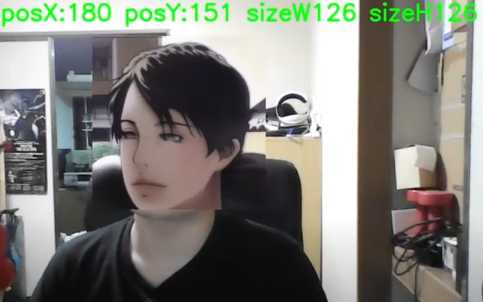
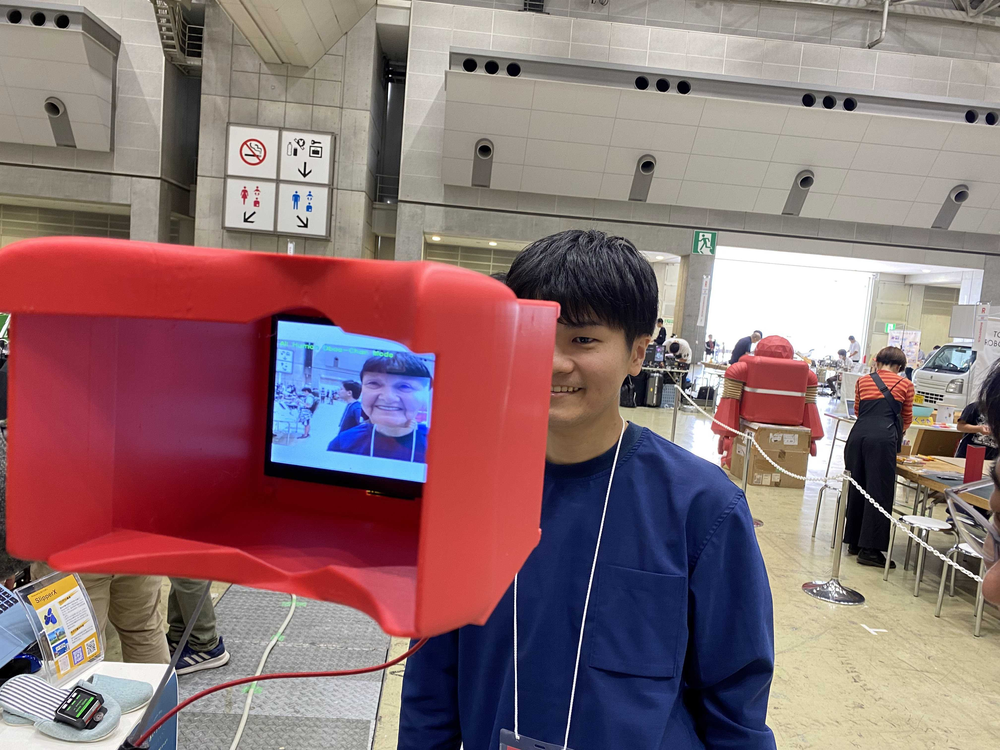
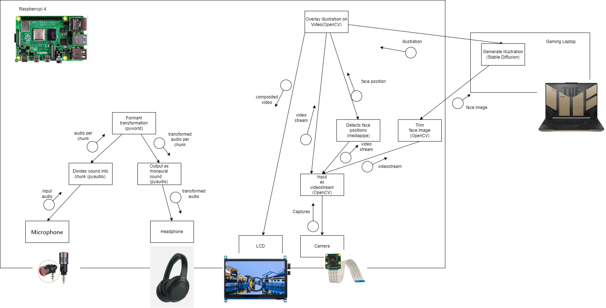

## Background and Development Purpose

In face-to-face communication, the appearance and voice quality of a person can make conversations difficult. For instance, it might be challenging to speak smoothly with a cute girl due to nervousness, or it can be hard to speak candidly with an older person who appears stern. In such cases, the person's appearance can act as noise, distracting from the essence of the communication.

To address this issue, we developed "RealityShiftAR" to transform the visible world and make communication smoother. By using these AR glasses, the appearance of people around you can change to look like animated characters or appear younger or older. Additionally, their voices are modified, enhancing the ease of face-to-face communication. This eliminates the noise caused by appearance, allowing for focused and effective communication.

The inspiration for this project came from Osamu Tezuka's "Phoenix" where the protagonist sees the surrounding world as monsters. Our goal is to transform reality in a more appealing way and facilitate smoother communication.

## System Overview
<blockquote class="twitter-tweet">
できたぜ自作シースルーＡＲヘッドセット!!! <a href="https://t.co/SerA9ycR6M">pic.twitter.com/SerA9ycR6M</a>
&mdash; Gakuto Sasabe (@gakuto66) <a href="https://twitter.com/gakuto66/status/1704482013351379307?ref_src=twsrc%5Etfw">September 20, 2023</a></blockquote> 

1. __Capture Video__: A camera mounted on a Raspberry Pi captures live video of the surroundings.

2. __Face Recognition and Cropping__: The captured video is processed using Mediapipe to recognize human faces. The facial regions are then cropped using OpenCV.

3. __Image Transmission and Generation__: The cropped facial images are sent via WiFi to a connected gaming laptop. The laptop uses Stable Diffusion, accessed through a Web API, to generate transformed images of the faces. These images are then sent back to the Raspberry Pi and stored locally.

4. __Overlay and Display__: The generated images are overlaid onto the recognized facial regions in the video. This combined video is then displayed on a screen, creating an augmented reality (AR) effect.

## Demo
### Anime character(female)
<iframe width="560" height="315" src="https://www.youtube.com/embed/h38BKrzTe98?si=aA0TIiuFBE3z3WGo" title="YouTube video player" frameborder="0" allow="accelerometer; autoplay; clipboard-write; encrypted-media; gyroscope; picture-in-picture; web-share" referrerpolicy="strict-origin-when-cross-origin" allowfullscreen></iframe>

### Anime character(male)
<iframe width="560" height="315" src="https://www.youtube.com/embed/Pe-oTPQHC2I?si=eZyOP_xiwIP0PvHM" title="YouTube video player" frameborder="0" allow="accelerometer; autoplay; clipboard-write; encrypted-media; gyroscope; picture-in-picture; web-share" referrerpolicy="strict-origin-when-cross-origin" allowfullscreen></iframe>

### Aging transformation
<iframe width="560" height="315" src="https://www.youtube.com/embed/J4s39xCwGRI?si=aQAnjRiPRETbyNLg" title="YouTube video player" frameborder="0" allow="accelerometer; autoplay; clipboard-write; encrypted-media; gyroscope; picture-in-picture; web-share" referrerpolicy="strict-origin-when-cross-origin" allowfullscreen></iframe>

### Blog
- [【StableDiffusion】リアルタイムで顔を美少女に変換する人類ギャルゲー化ARグラスを作った【OpenCV】](https://chamekichi.hatenadiary.jp/entry/2023/10/02/234230)