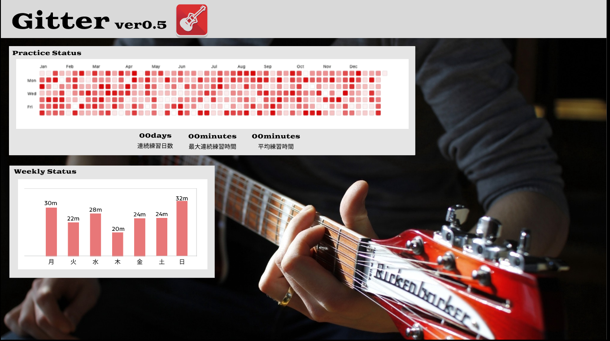
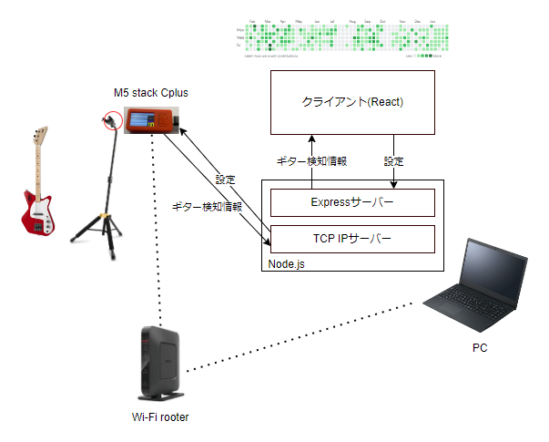

Have you ever thought "I can't keep practicing guitar, I wish the grass would grow everyday like Github..." Gitter is a system that uploads your guitar practice data to the web and visualizes it like Github. Gitter is a system that allows you to upload your guitar practice data to the web and visualize it like Github.

The system is configured as follows

The M5 Stack Cplus attached to the guitar stand determines whether the guitar is attached to the stand or not (if the guitar is removed, it is assumed that the guitar is practicing). The Node.js server converts the guitar detection information into information about when and for how long the guitar was practiced, and sends it to the front side written in React. The front end visualizes the guitar practice information like Github and other user-friendly information.

Please check the video below to see it in action!

<blockquote class="twitter-tweet">
Gitterできた <a href="https://t.co/MeaPRU0RvL">pic.twitter.com/MeaPRU0RvL</a>
&mdash; Gakuto Sasabe (@gakuto66) <a href="https://twitter.com/gakuto66/status/1646922593293967361?ref_src=twsrc%5Etfw">April 14, 2023</a></blockquote> 
