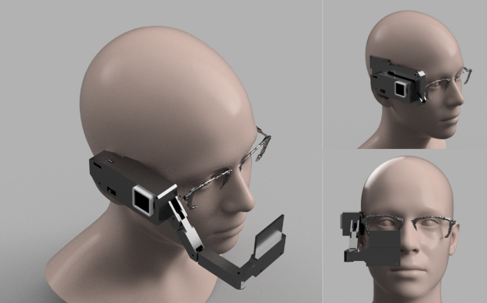
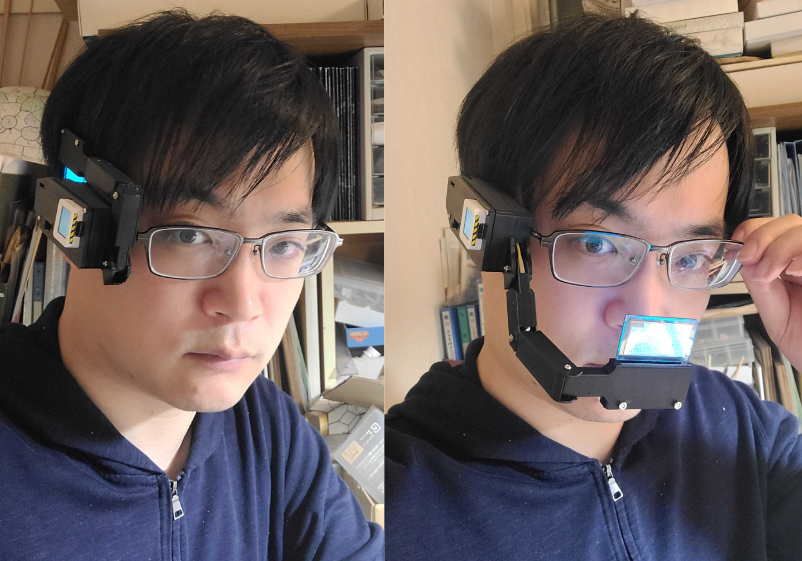
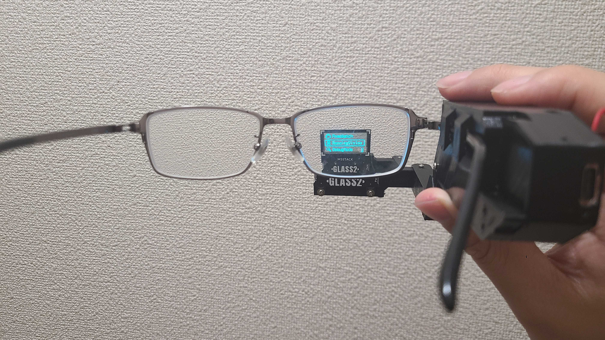
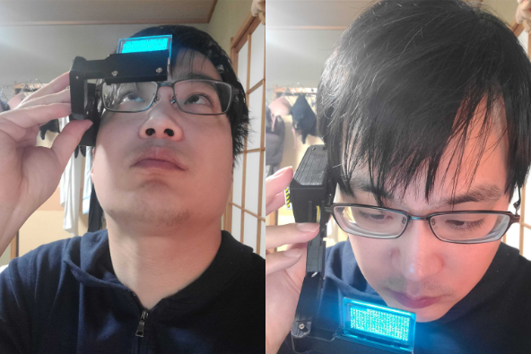
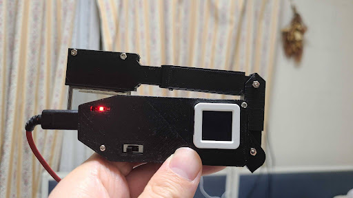
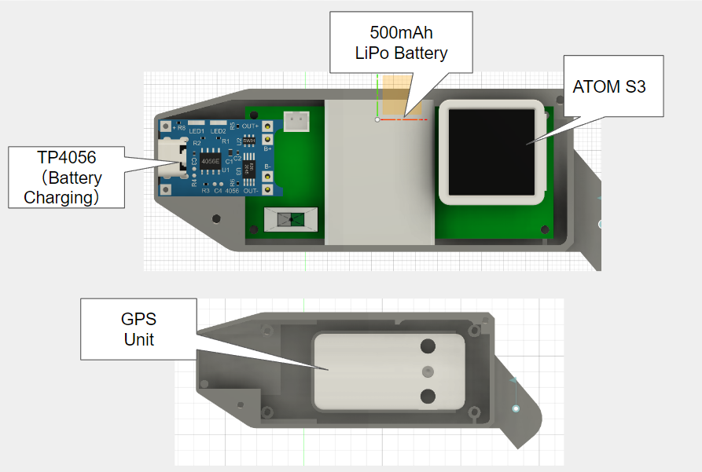
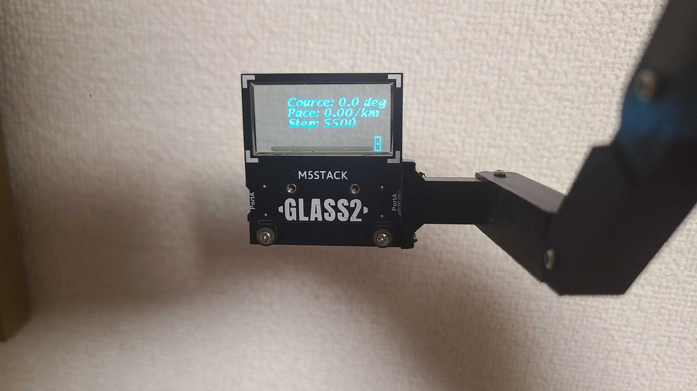

M5 Scouter is a custom-made AR device that I developed as a hobby project. This device was born from the idea of creating an AR device that is more affordable and accessible to everyone. (Link: ) Currently, the device features Running Vision, which displays running speed and direction to the destination in your field of vision while running, and Pomo Watch, which displays a Pomodoro technique timer in your field of vision.

## System Overview
M5 Scouter can be mounted on any pair of glasses. Additionally, it can be folded away when it obstructs your view.

Here is what the view looks like when wearing the M5 Scouter.

The device is operated by a combination of head direction while wearing the device and a push switch on the side of the device.

It can be charged using a USB-C cable and lasts for about three hours on a single charge.

M5 Scouter is composed of an ATOMS3, a 500mAh LiPo battery, a TP4056 charging board, and a GPS unit. The installed ATOMS3 can be replaced with other ATOM series modules. For example, by installing an ATOM Echo instead, you can easily add sensors such as a microphone and speakers.

## Device function
### Running Vision (Under Development)
Running Vision is an application that informs you of your running speed and the direction to your destination while running. It was developed because we found it inconvenient to have to bring the screen of an existing smartwatch close to your eyes to check information. We are also developing a feature that warns you when you are running with poor posture.

### Pomo Watch (Under Development)
Pomo Watch is an application that displays a Pomodoro technique timer in your field of vision, which is known as a method to enhance productivity. We developed it because existing Pomodoro technique management tools on smartphones and PCs often lead to distraction by other applications.

