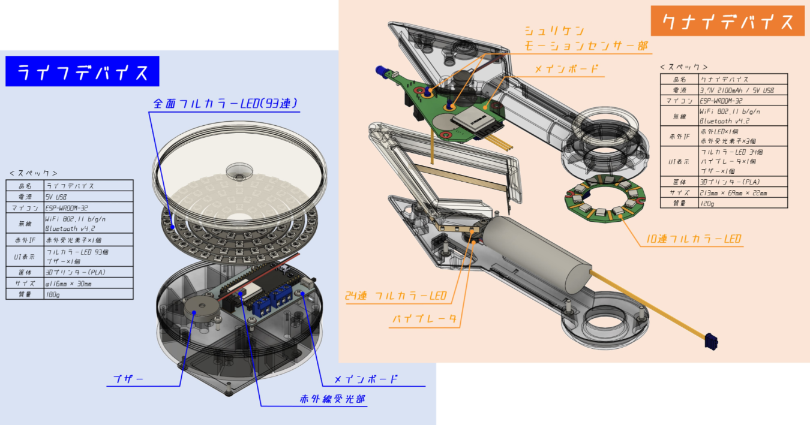
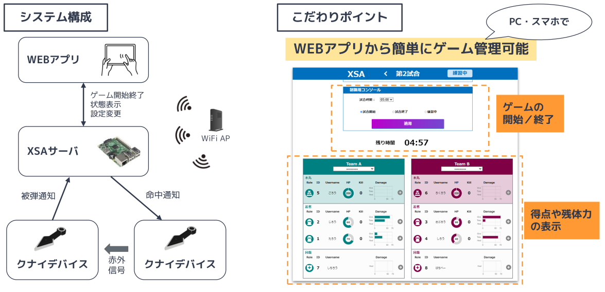

 
    <iframe width="1120" height="630" src="https://www.youtube.com/embed/tHYvxFTPyQs?si=kwk94GOrfBximGW5" title="YouTube video player" frameborder="0" allow="accelerometer; autoplay; clipboard-write; encrypted-media; gyroscope; picture-in-picture; web-share" allowfullscreen></iframe>

### Overview
This is a shooting game device in which both adults and children pretend to be ninjas and throw invisible shurikens at each other. When you point the kunai device at the enemy and make a motion to throw shuriken, you can damage the enemy's device. You win when you reduce the enemy device's health to zero. You can play in various game modes such as individual, team and shogun battles.

### Game System

#### KUNAI Device
This device is capable of detecting the motion of throwing a Shuriken and firing and receiving infrared rays.
It is equipped with 34 full-color LEDs for status indication, a vibrator, and a speaker to provide a realistic experience.
It is a new type of device that condenses various functions into a kunai shape.

#### LIFE Device
This is a physical strength display device dedicated to infrared reception.
It detects attacks by the kunai device and 93 full-color LEDs flash to inform the player of his or her fitness.

### Real-time battle status confirmation application

The following functions are realized by connecting a PC and each device via Wi-Fi.
Game start and end (simultaneous operation of multiple devices)
Game balance settings (e.g., maximum strength settings for each device)
Real-time game progress status and remaining health of each device
The system enables real-time communication with multiple devices, allowing players to start a game even when they are hidden behind walls or other obstacles and do not know each other's location.
This system brings a wide range of strategic and convenient features to the game.

## Event 
- 2023 Tokyo Maker Faire 
- 2023 Kyoto Maker Faire
- 2022 Ogaki Mini Maker Faire

## Achivement
- 2019 __Sponser Award__, GUGEN 2019(Hardware Contest)