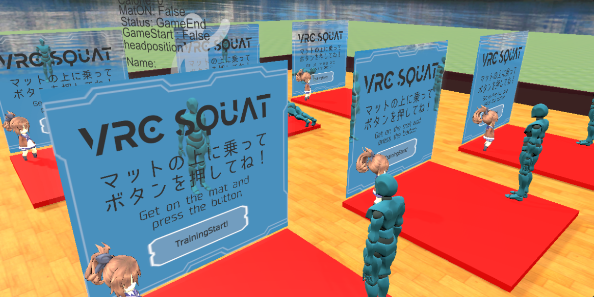

We created a world where you can do muscle training in VR Chat. Two types of muscle training, push-ups and squats, can be played. By watching the instructor avatar next to the player while performing the muscle training, the player can train with correct form. Also, get support from the girl avatar during muscle training to get through a tough workout! Training is detected from the position of the player's head on the muscle training machine.

↓Here's how the training went

<blockquote class="twitter-tweet">
VRChat内でスクワットと腕立て伏せができるワールドを公開しました！美少女に応援されながら筋トレができます.隣にいるアバターを真似して筋トレすればフォームもばっちり！OMMF2022でも展示します！<a href="https://twitter.com/hashtag/MadeWithVRChat?src=hash&amp;ref_src=twsrc%5Etfw">#MadeWithVRChat</a> <a href="https://t.co/tmns0KlFcg">https://t.co/tmns0KlFcg</a> <a href="https://twitter.com/hashtag/VRChat?src=hash&amp;ref_src=twsrc%5Etfw">#VRChat</a> <a href="https://twitter.com/hashtag/VRChat%E3%83%AF%E3%83%BC%E3%83%AB%E3%83%89%E7%B4%B9%E4%BB%8B?src=hash&amp;ref_src=twsrc%5Etfw">#VRChatワールド紹介</a> <a href="https://twitter.com/hashtag/VRChat_world%E7%B4%B9%E4%BB%8B?src=hash&amp;ref_src=twsrc%5Etfw">#VRChat_world紹介</a> <a href="https://t.co/Vbj8nQQGkX">pic.twitter.com/Vbj8nQQGkX</a>
&mdash; Gakuto Sasabe (@gakuto66) <a href="https://twitter.com/gakuto66/status/1596396970070810625?ref_src=twsrc%5Etfw">November 26, 2022</a></blockquote> 

WorldURL
- https://vrchat.com/home/launch?worldId=wrld_755d6cba-cdbc-4889-b9ca-fa7448c9a54c